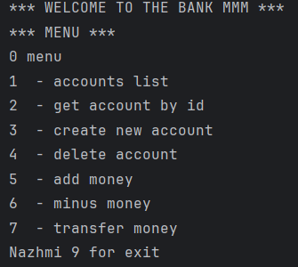

# Проект "Банковская система"

В проекте "Банковская система" есть функции создания нового банковского аккуанта,
удаления аккаунта, поиска аккауната по ID, перевод денег с одного аккаунта на другой,
снятие и пополнеие денежных средств. Для обозначения денежных средств использовалась
переменная BigDecimal.

# База данных

База данных MySQL. В ней хранятся данные об аккаунтах, подключение через JDBC:

    private static final String URL = "jdbc:mysql://localhost:3306/mysql";
    private static final String USER_NAME = "root";
    private static final String PASSWORD = "root";
    private Connection connection;

    public DataBaseConnector() {
        try {
            Class.forName("com.mysql.cj.jdbc.Driver");
            this.connection = DriverManager.getConnection(URL, USER_NAME, PASSWORD);
        } catch (SQLException | ClassNotFoundException e) {
            e.printStackTrace();
        }
    }

# Паттерны проектирования

Паттерн Singleton применяется для гарантии того, что будет только один
экземпляр класса InMemoryBankRepository, что позволяет избежать конфликтов
при работе с общими данными.

    private static InMemoryBankRepository instance;
    public static InMemoryBankRepository getInstance() {
        if (instance == null) {
            instance = new InMemoryBankRepository();
        }
        return instance;
    }

Паттерн Fabric применяется для создания компонентов меню.

    public <T> Component build(int type, Service<T> service){
        try {
            ComponentType componentType = ComponentType.fromType(type);
            return componentMap.computeIfAbsent(componentType, (v)->{
                Component component;
                switch (v){
                    case MENU:
                        component = new Menu();
                    break;
                    case LIST:
                        component = new ListComponent<>(service);
                        break;
                    case ACCOUNT:
                        component = new AccountComponent<>(service);
                        break;
                    case CREATE_ACCOUNT:
                        component = new CreateComponent((Service<BankAccount>) service);
                        break; ...

# Пользовательский интерфейс

Пользовательский интерфейс консольный, ввод в консоль осуществляется через класс Scanner.

Отрисовка меню происходит с помощью метода draw()

    @Override
    public void draw() {
        System.out.println("*** WELCOME TO THE BANK MMM ***");
        System.out.println("*** MENU ***");
        Arrays.stream(ComponentType.values()).map(v->v.getType()
        + " " + v.getComment()).forEach(System.out::println);
        System.out.println("Push 9 for exit\n");
    }
Пользователь выбирает нужный компонент меню, вводит в консоль номер компонента
и получает данные или поля для ввода.